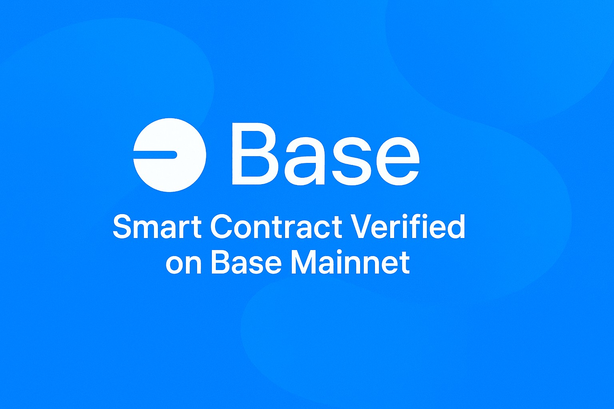

# Base My Storage Contract



[](https://github.com/danyzly/base-my-storage-contract/releases)
[](./LICENSE)
[](./CONTRIBUTING.md)

Contrato **SimpleStorage** escrito en Solidity y desplegado en **Base Mainnet**, con verificación en **Blockscout**.  
Este proyecto sirve como ejemplo educativo para desarrolladores que quieran iniciarse en el ecosistema Base y EVM.

---

## 📇 Contrato desplegado

| Campo                 | Valor |
|-----------------------|-------|
| Red                   | Base (chainId `8453`) |
| Dirección             | `0xA8888Dd2B317ca5e478401C723Ac0062A03e9A81` |
| Explorer              | [Blockscout](https://base.blockscout.com/address/0xA8888Dd2B317ca5e478401C723Ac0062A03e9A81?tab=contract) |
| Compilador (Solidity) | 0.8.24 (EVM: Cancun, Optimizer enabled, runs 200) |
| Licencia              | MIT |

---

## 📖 ¿Qué hace este contrato?

El contrato implementa un **almacenamiento simple de números** en la blockchain.  
Permite dos operaciones básicas:

- `setNumber(uint256 newNumber)` → guarda un número en la blockchain.  
- `getNumber()` → devuelve el número almacenado.  

---

## 🛠️ Artifacts

- [MyStorage.abi.json](./artifacts/MyStorage.abi.json)  
- [MyStorage.bytecode.json](./artifacts/MyStorage.bytecode.json)  

---

## 🖼️ Screenshots

- [Despliegue en Remix](./images/remix-deploy.png)  
- [Verificación en Blockscout](./images/blockscout-verify.png)  

---

## 🚀 Cómo interactuar

1. Abre el contrato en [Blockscout](https://base.blockscout.com/address/0xA8888Dd2B317ca5e478401C723Ac0062A03e9A81?tab=contract).  
2. Conecta tu wallet (ej: MetaMask).  
3. Usa la pestaña **Read Contract** para leer el número almacenado.  
4. Usa la pestaña **Write Contract** para actualizarlo con `setNumber`.  

---

## 💻 Ejemplo con Ethers.js

```js
import { ethers } from "ethers";
import abi from "./artifacts/MyStorage.abi.json";

const provider = new ethers.JsonRpcProvider("https://mainnet.base.org");
const signer = await provider.getSigner();

const contract = new ethers.Contract(
  "0xA8888Dd2B317ca5e478401C723Ac0062A03e9A81",
  abi,
  signer
);

// Guardar un número
await contract.setNumber(42);

// Leer el número
const num = await contract.getNumber();
console.log("Número guardado:", num);

## 📦 Instalación local

git clone https://github.com/danyzly/base-my-storage-contract.git
cd base-my-storage-contract
npm install

Puedes compilar y desplegar el contrato usando Remix o configurar un entorno con Hardhat/Foundry.

---

## 📜 Licencia

Este proyecto está bajo la licencia MIT.
Consulta el archivo LICENSE
 para más detalles.

---

## 🙌 Contribuciones

¡Las contribuciones son bienvenidas!
Por favor revisa la guía en CONTRIBUTING.md
 antes de enviar un pull request.

---

## 🔒 Seguridad

Si encuentras alguna vulnerabilidad, revisa la política de seguridad

y abre un issue de forma responsable.

